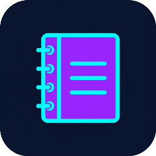

<p align="center">
  <a href="https://github.com/studio2201">
    
  </a>
</p>

#  Pad

[](https://github.com/studio2201/pad/actions/workflows/ci.yml)

Collaborative real-time scratchpad built in Rust.

## Quick Start

### Self-Hosting (Docker)
Pull and run the official Docker container:
```bash
docker run -d -p 4402:4402 -v /path/to/appdata:/app/data ghcr.io/studio2201/pad:latest
```
